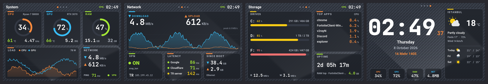
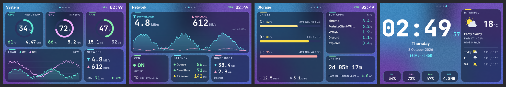
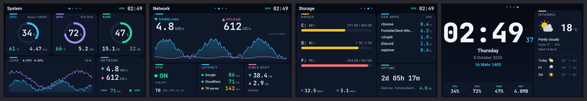
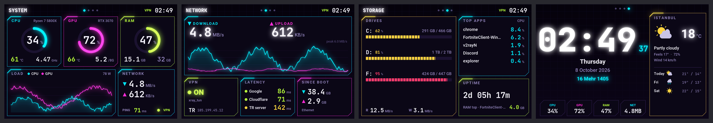
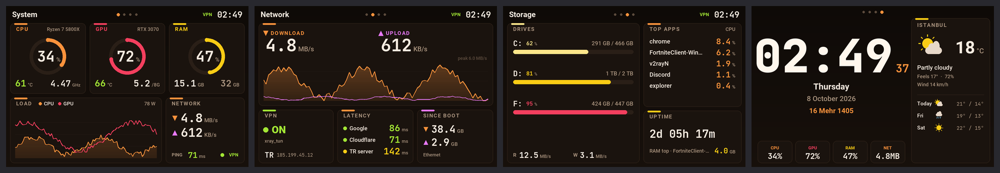
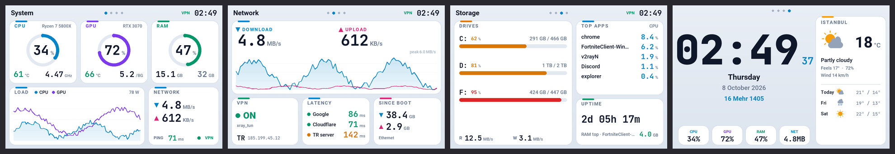
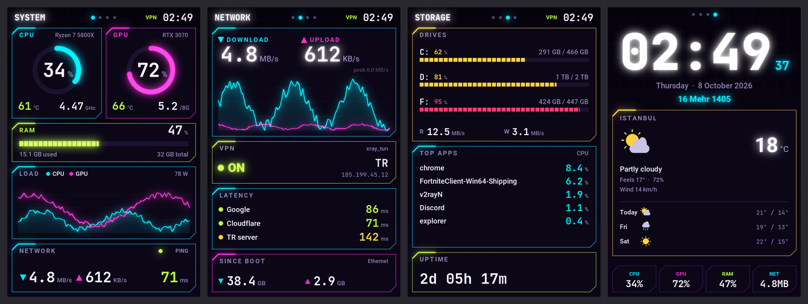
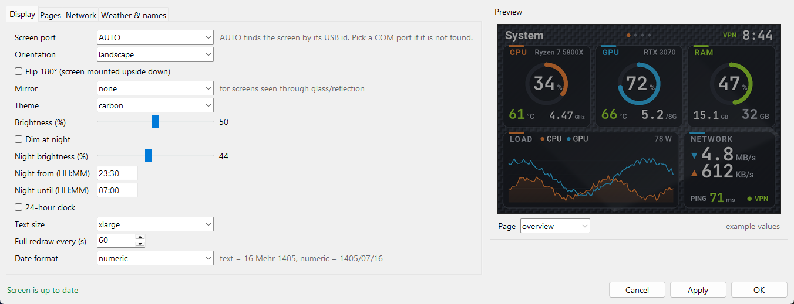

<div align="center">

# Smart-Screen

**A modern replacement for the "UsbMonitor" app of 3.5" USB system-monitor screens (Turing Smart Screen rev A and clones).**

English · [فارسی](README.fa.md) · [Website](https://plus98ir.github.io/Smart-Screen/)



</div>

## Which screens does it work with?

Smart-Screen talks to the screen with the **rev A serial protocol** (USB CDC, 115200 baud). It works with:

| Screen | Size / resolution | How to recognise it |
|---|---|---|
| **Turing Smart Screen 3.5"** (original, rev A) | 3.5", 320×480 | USB ID `VID_1A86 & PID_5722` in Device Manager |
| **3.5" "UsbMonitor" / "UsbPCMonitor" IPS screens** (AliExpress / Amazon clones, often sold as "3.5 inch IPS USB-C computer monitor / AIDA64 sub-screen") | 3.5", 320×480 | Came with **UsbMonitor.exe**; USB serial number `USB35INCHIPSV2` |

Both are found automatically (by USB ID or serial number). If yours shows up as a different COM port, pick it by hand in **Settings → Screen port**.

**Not supported (different protocol):** Turing 2.1" / 5" / 8.8" (rev C), XuanFang 3.5" (rev B), Kipye / WeAct screens (rev D). For those, use [turing-smart-screen-python](https://github.com/mathoudebine/turing-smart-screen-python).

**Computer:** Windows 10 / 11, 64-bit. Python 3.10+ (the installer installs Python 3.14 with winget if none is found).

> Close the vendor **UsbMonitor.exe** first. Only one program can use the screen's COM port at a time; the installer offers to turn off its autostart.

## Features

- **4 pages**, rotating automatically or fixed:
  - **System**: CPU / GPU / RAM gauges, temperatures, clocks, power, load graph, network and ping
  - **Network**: download / upload graph, VPN status, public IP + country, HTTP latency to several targets (and your own server, optional), traffic since boot
  - **Storage**: every drive with fill bar, disk read / write, top apps by CPU, uptime
  - **Clock**: big clock, Gregorian + Jalali (Persian) date, weather with a 3-day forecast
- **6 themes**: Midnight, Neon (glow), Ember, Frost (light), Aurora and Carbon (textured backgrounds that hide LCD ghosting / burn-in)
- **Landscape and portrait**, plus **Flip 180°** and **Mirror** (horizontal / vertical) for screens mounted upside down or seen through glass
- **Text size**: normal, large, extra large; values shrink to fit instead of overflowing
- **Brightness** and **night dimming** (time window)
- **Fast**: draws one frame a second and sends only the parts that changed
- **Tray icon** for everything (theme, page, rotation, brightness, screen off, restart) and a **Settings window with live preview**: nothing reaches the screen until you press Apply
- **Real temperatures** through LibreHardwareMonitor (CPU and GPU), with `nvidia-smi` as a fallback for NVIDIA cards
- **VPN-aware latency**: measured as an HTTP round trip on an open connection, so TUN-mode VPNs (v2rayN, sing-box, Clash…) can't fake a 1 ms ping
- **Clear ghost image**: a slow colour cycle at full brightness that helps fade LCD image retention
- **Starts with Windows** (scheduled task with admin rights, needed for CPU temperatures), no UAC prompt

## Screenshots

All 4 pages per theme (rendered by the app itself with sample data):

| Theme | Landscape (480×320) |
|---|---|
| Carbon |  |
| Aurora |  |
| Midnight |  |
| Neon |  |
| Ember |  |
| Frost |  |

Portrait (320×480):



Settings window with live preview:



## Install

1. **Download**: green **Code** button → **Download ZIP**, then extract it to a permanent folder (for example `Documents\Smart-Screen`).
2. Plug in the screen and **close UsbMonitor.exe** if it is running.
3. Double-click **`install.bat`** and accept the admin prompt. It:
   - closes UsbMonitor and offers to turn off its autostart
   - finds or installs Python, creates `.venv` and installs the packages (offline wheels for Python 3.14 are included; other versions download from PyPI)
   - installs the **PawnIO** driver that LibreHardwareMonitor needs for CPU temperatures
   - creates the **"Smart-Screen"** scheduled task (starts at logon, with admin rights) and starts the app
4. The tray icon appears. Right-click → **Settings…** to pick theme, orientation, pages, weather city and more.

| File | What it does |
|---|---|
| `install.bat` | Install or update (safe to run again) |
| `start.bat` / `stop.bat` | Start / stop the background app |
| `run-console.bat` | Run in a console window to see errors |
| `uninstall.bat` | Remove the scheduled task (your files stay) |

Settings are saved in `config.yaml` next to `main.py` and reload by themselves when the file changes. The log is `smartscreen.log`.

## Troubleshooting

| Problem | Fix |
|---|---|
| "Screen not found" in the tray | Close UsbMonitor.exe, replug the USB cable, or pick the COM port in Settings → Screen port |
| CPU temperature is empty | The app must run as admin (use `start.bat` / the scheduled task, not `python main.py`) and PawnIO must be installed (run `install.bat` again) |
| Picture is upside down | Tray → Rotate / Flip → Flip 180° |
| Text is too small | Tray → Text size → Large or Extra large |
| Faint old image shows through dark themes | That is LCD retention from the old app: try tray → Clear ghost image, or the Aurora / Carbon themes |
| Ping shows < 1 ms with a VPN | Use a URL target (default), not a local address; latency is measured over HTTP for this reason |

## For developers

```
main.py          app loop, page rotation, night dimming, tray menu
settings.py      Settings window (tkinter) with live preview
core/screen.py   partial updates: changed 16-px bands -> RGB565 -> screen
core/pages.py    the 4 pages, landscape + portrait layouts
core/themes.py   the 6 themes
core/sensors.py  psutil + LibreHardwareMonitor + nvidia-smi
core/online.py   latency, public IP / country, weather (open-meteo)
library/lcd/     rev A driver from turing-smart-screen-python
tools/preview.py renders every theme/page to previews/ without a screen
tools/test_protocol.py  fake serial port that checks partial updates rebuild the exact frame
```

```
python tools/preview.py            # or: python tools/preview.py xlarge
python tools/test_protocol.py
```

## Credits and license

- Screen driver: [turing-smart-screen-python](https://github.com/mathoudebine/turing-smart-screen-python) by mathoudebine (GPL-3.0)
- Sensors: [LibreHardwareMonitor](https://github.com/LibreHardwareMonitor/LibreHardwareMonitor) (MPL-2.0) and the [PawnIO](https://pawnio.eu/) driver
- Weather: [Open-Meteo](https://open-meteo.com/); IP / country: Cloudflare trace
- Fonts: JetBrains Mono (OFL), Roboto (Apache 2.0), Race Space (free for non-commercial use)

Smart-Screen is released under the **GNU GPL v3**, see [LICENSE](LICENSE).
